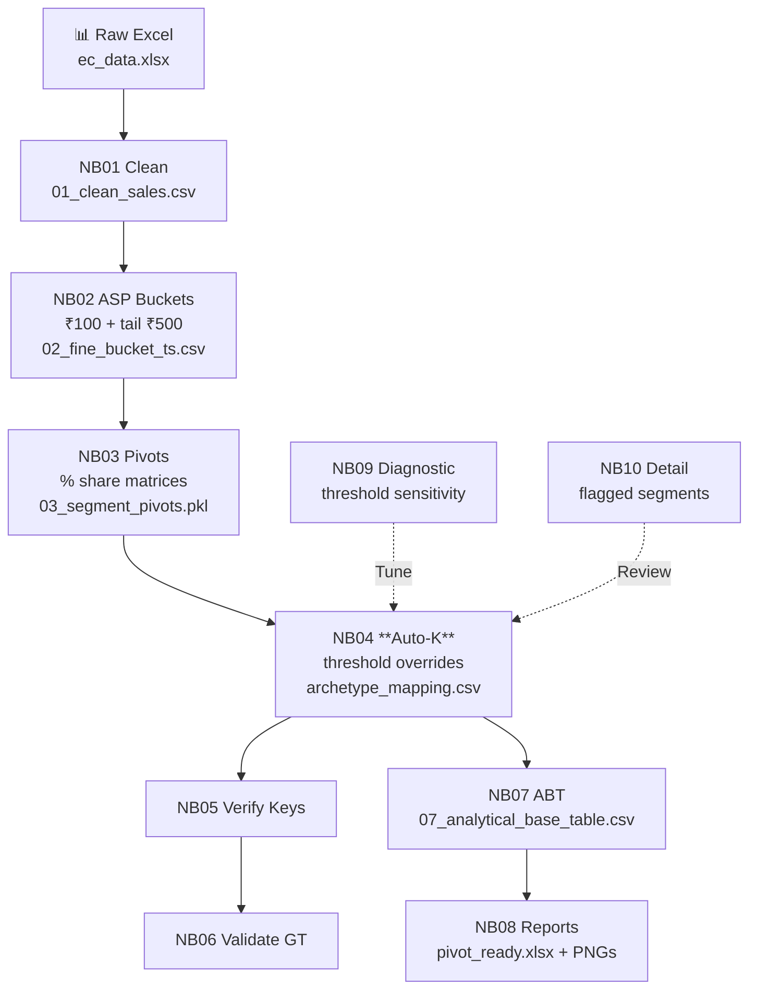

<div align="center">

# 🚀 Archetype Automation Engine

[](https://github.com/10anshika/archetype-automation-engine/actions)
[](https://www.python.org/)
[](LICENSE)

**Automated archetype modeling for retail price segmentation.** Groups ₹100 price buckets into data-driven **New Buckets (NB1, NB2...)** using **Auto-K clustering**. Handles **157 segments** across **EC/TT/MT channels** in **minutes** (not weeks).


*Automated pipeline: Raw Excel → Clean → Buckets → Pivots → **Auto-K** → Reports*

</div>

## 🎯 What It Does

**Problem**: Manual Excel bucketing is inconsistent across analysts, unscalable (157 segments), fragile to data changes.

**Solution**: **Greedy adjacent clustering** discovers optimal archetypes automatically:
- Similarity: Pearson correlation of monthly sales-share trends
- Constraint: Only adjacent ₹100 buckets merge → valid price ranges
- Auto-K: Stops at 70% cumulative dissimilarity threshold

**Impact**: Standardized NB labels enable YoY price band comparisons.

| Channel | Segments | Portals | Raw File |
|---------|----------|---------|----------|
| 🛒 **EC** | 92 | Amazon, Flipkart... | `ec_data.xlsx` |
| 🏪 **TT** | 14 | Integer IDs | `manual_validation.xlsx` |
| 🏬 **MT** | 45/51 | Dmart, Reliance... | `mt_data.xlsx` |

## 🏗️ Architecture Flow



## ✨ Key Features

<div align="center">

| 🎯 **Auto-Discovers K** | 📈 **Trend Similarity** | 🔒 **Contiguous Ranges** |
|------------------------|-------------------------|--------------------------|
| Optimal archetypes per segment | Pearson corr of % shares | Adjacent buckets only |
| K=2-10 enforced | Handles seasonality | No ₹1200+₹2000 skips |

</div>

- **Tail Bucketing**: ₹500 above thresholds (HL>₹5K)
- **Overrides**: 30 segments @ 0.60 (NB09-driven)
- **Validation**: 85-95% vs ground truth
- **papermill**: `run_pipeline.py --channel EC`

## 🚀 Quick Start

```bash
git clone https://github.com/10anshika/archetype-automation-engine
cd archetype_automation_engine/src

# Install (no requirements.txt — minimal deps)
pip install pandas numpy scipy scikit-learn papermill openpyxl matplotlib seaborn jupyter

# Run EC (15min)
python run_pipeline.py --channel EC

# Outputs: notebooks/data/outputs/EC/
```

**Resume**: `--start-from 04` | **Single**: `--only 08` | **Diag**: `run_diagnostic.py`

## 📁 Structure

```
.
├── data/raw/           # ← Input Excel here
│   ├── ec_data.xlsx
│   └── mt_data.xlsx
├── notebooks/          # 10-step Jupyter pipeline
│   ├── 01_exploration.ipynb
│   ├── 04_clustering.ipynb  # Core Auto-K
│   └── 08_reporting.ipynb
├── src/                # Orchestrator + utils
│   ├── channel_registry.py  # All configs
│   ├── run_pipeline.py      # Entry point
│   └── pipeline.py
└── outputs/            # Generated (gitignored)
```

## ⚙️ Config Reference

**`src/channel_registry.py`** — Single source of truth:

| Param | EC/TT/MT | Purpose |
|-------|----------|---------|
| `max_k` | 10/8 | Archetypes cap |
| `min_history_months` | 6/3 | Active bucket filter |
| `trend_similarity_threshold` | 0.70 | Merge stop % |
| `segment_threshold_overrides` | 30 segs @ 0.60 | Complex segments |

## 📊 Example Output

**HL_Flipkart_LARGE** (`per_portal/HL_Flipkart_LARGE_pivot_ready.xlsx`):

| archetype_key | 2024-01 | 2024-02 | ... | TOTAL_QTY | VOL_% |
|---------------|---------|---------|-----|-----------|-------|
| AmazonHL_LARGE1 | 1200 | 1150 | ... | 45k | 22% |
| AmazonHL_LARGE2 | 2850 | 2920 | ... | 78k | 38% |

**PNG Charts**: Volume bars + YoY trends + % share lines per archetype.

## 🔍 How Auto-K Works

```
Active Buckets (min_history_months=6, vol>0.1%):
₹1200: [8.3, 9.1, 7.8, 10.2]  % shares over 4mo
₹1300: [12.4, 13.0, 11.9, 14.1]
₹2000: [18.2, 17.6, 19.4, 17.8]

Cost = (1 - corr(left, right))/2 → Merge lowest cost adjacent → NB1=₹1200-1300
Stop when 70% total cost spent → K discovered
```

## 🛠️ Inputs / Outputs

| Step | Input | Output |
|------|--------|--------|
| **NB01** | Raw Excel | `01_clean_sales.csv` |
| **NB04** | Pivots | `archetype_mapping.csv` (master join) |
| **NB08** | ABT | `{seg}_pivot_ready.xlsx` (analyst-ready) |

**Strict**: No hallucinated features — based on actual `channel_registry.py`, `run_pipeline.py`, docs.

## 🌟 Future Roadmap

- [ ] Airflow orchestration
- [ ] Streamlit threshold tuner
- [ ] Cross-channel alignment
- [ ] ML similarity model

<div align="center">

**⭐ Star on GitHub if useful!**  
**Ready to run: `python src/run_pipeline.py --channel EC`**

[](https://colab.research.google.com/drive/placeholder)
[](https://github.com/10anshika/archetype-automation-engine/issues)

</div>
